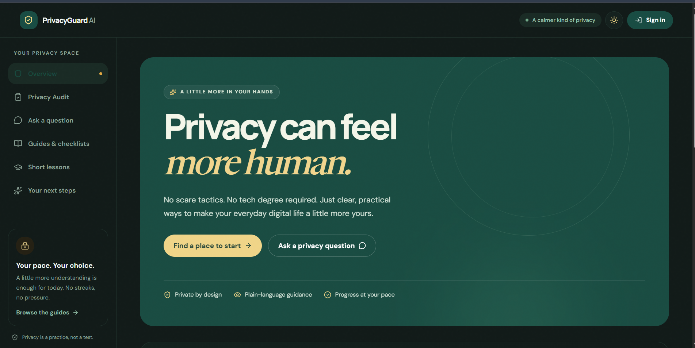
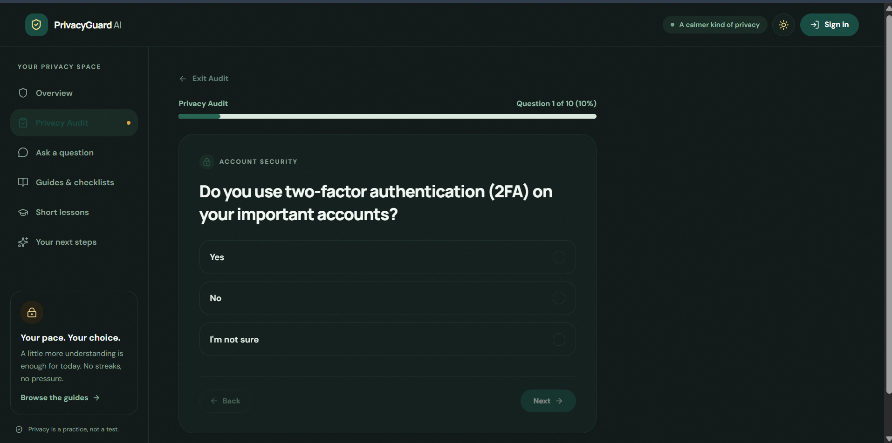
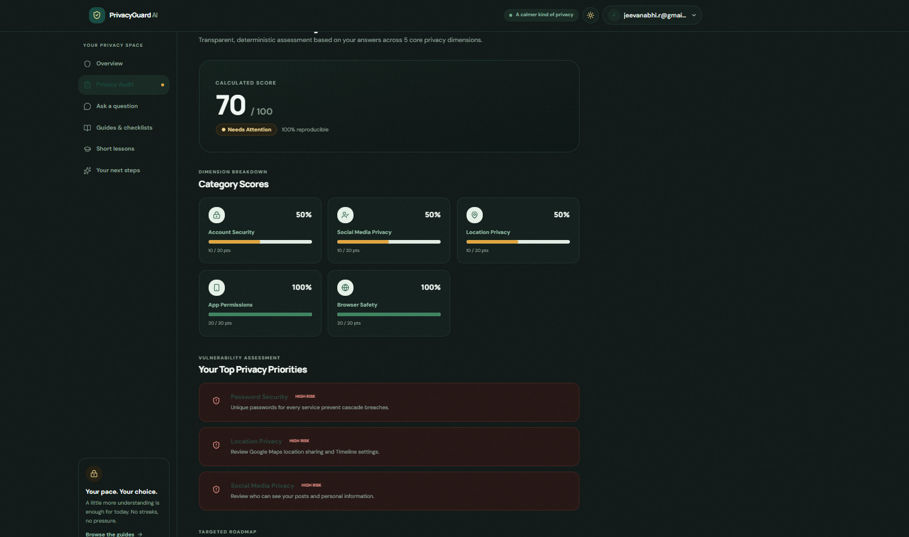
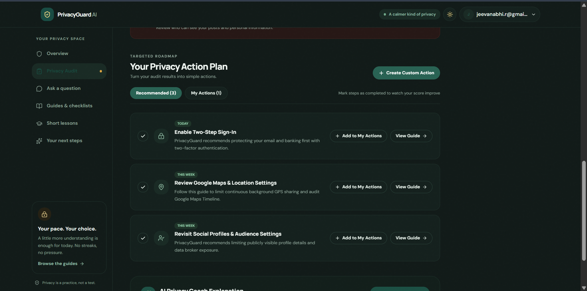
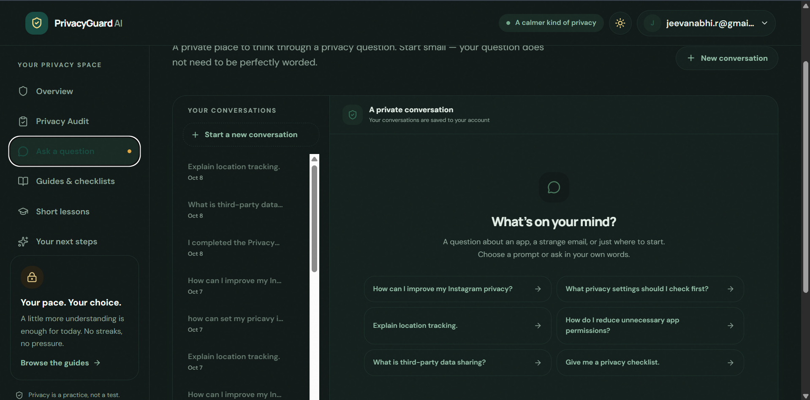

<div align="center">

# 🛡️ PrivacyGuard AI

### A calmer, smarter way to protect your digital privacy.

<p>
  <a href="https://privacy-guard-ai-roan.vercel.app">
    
  </a>
  <a href="https://github.com/jeevanabhi-r/PrivacyGuard-AI">
    
  </a>
</p>

<p>
  
  
  
  
  
</p>

> **Understand your privacy. Take action. Build better digital habits.**

</div>

---

## 🌐 See PrivacyGuard AI in Action

<div align="center">

### 🚀 [Open Live Demo](https://privacy-guard-ai-roan.vercel.app)

### 💻 [View Source Code](https://github.com/jeevanabhi-r/PrivacyGuard-AI)

</div>

---

## 🎯 The Problem

Digital privacy is becoming harder to understand.

Most people don't know:

- 🔐 Whether their accounts are properly protected
- 📱 Which apps have access to their data
- 📍 Who can access their location
- 👥 How much information they expose on social media
- 🌐 How much tracking happens while browsing
- ⚠️ What privacy settings they should actually change

Privacy policies are long and technical. Privacy tools can be complicated.

### People don't need more warnings.

### They need to know **what to do next.**

---

# 💡 Our Solution

## PrivacyGuard AI

PrivacyGuard AI is a **digital privacy companion** that turns confusing privacy problems into simple, actionable steps.

```text
       🔍 ASSESS
           ↓
       📊 SCORE
           ↓
       ⚠️ UNDERSTAND RISKS
           ↓
       ✅ TAKE ACTION
           ↓
       📚 LEARN
           ↓
       🤖 ASK AI
           ↓
       📈 IMPROVE
```

---

# ✨ What You Can Do

<table>
<tr>
<td width="50%">

### 🔍 Privacy Audit

Take a simple **10-question assessment** covering:

- Account Security
- Social Media Privacy
- Location Privacy
- App Permissions
- Browser Safety

</td>

<td width="50%">

### 📊 Privacy Score

Get a transparent **0–100 Privacy Score** with:

- Category breakdown
- Risk identification
- Priority recommendations
- Action plan

</td>
</tr>

<tr>
<td>

### ✅ Privacy Actions

Create and manage your own privacy actions.

**Full CRUD support:**

- Create
- Read
- Update
- Complete
- Delete

</td>

<td>

### 🤖 AI Privacy Assistant

Ask privacy questions in simple language and receive practical guidance powered by **Groq AI**.

</td>
</tr>

<tr>
<td>

### 📚 Privacy Learning

Learn through:

- Privacy Guides
- Short Lessons
- Interactive Quizzes

</td>

<td>

### 🌗 Dark & Light Mode

A polished privacy-focused interface with:

- Dark Mode
- Light Mode
- Responsive design
- Accessible components

</td>
</tr>
</table>

---

# 📸 Product Preview

> Add your actual screenshots inside `docs/screenshots/`.

### 🏠 Privacy Dashboard

<p align="center">
  
</p>

### 🔍 Privacy Audit

<p align="center">
  
</p>

### 📊 Privacy Score & Risks

<p align="center">
  
</p>

### ✅ Privacy Actions

<p align="center">
  
</p>

### 🤖 AI Privacy Assistant

<p align="center">
  
</p>

---

# 🔐 Privacy-First by Design

PrivacyGuard AI follows a **zero-credential approach**.

We never ask users for:

```text
❌ Passwords
❌ OTPs
❌ API Keys
❌ Session Cookies
❌ Private Keys
❌ Recovery Codes
❌ Banking Credentials
```

> **PrivacyGuard teaches users how to protect their accounts without requiring access to them.**

---

# 🧠 AI Architecture

```text
                         USER
                           │
                           ▼
                  ┌─────────────────┐
                  │  React Frontend │
                  └────────┬────────┘
                           │
                           ▼
                  ┌─────────────────┐
                  │ Supabase Auth   │
                  └────────┬────────┘
                           │
                           ▼
              ┌─────────────────────────┐
              │ Supabase Edge Function  │
              │                         │
              │ • Authentication        │
              │ • Validation            │
              │ • Rate Limiting         │
              │ • History Persistence   │
              └────────────┬────────────┘
                           │
                           ▼
                    ┌─────────────┐
                    │    GROQ     │
                    │     AI      │
                    └─────────────┘
```

### AI Model

```text
Provider: Groq
Model: openai/gpt-oss-120b
```

The Groq API key is stored only as a **Supabase Edge Function secret**.

---

# 🛡️ Security

- 🔒 Supabase Authentication
- 🧱 PostgreSQL Row Level Security
- 🚦 Database-backed AI rate limiting
- 🔑 Secrets kept out of frontend and GitHub
- 👤 User-owned Privacy Actions

```text
User A → Only User A's Actions
User B → Only User B's Actions
```

---

# 📊 Privacy Score

Each audit contains **10 questions** across **5 privacy dimensions**.

| Dimension | Questions |
|---|---:|
| 🔐 Account Security | 2 |
| 👥 Social Media Privacy | 2 |
| 📍 Location Privacy | 2 |
| 📱 App Permissions | 2 |
| 🌐 Browser Safety | 2 |

### Scoring

```text
YES          → 10 points
I'M NOT SURE →  5 points
NO           →  0 points
```

### Rating

```text
90–100  🟢 Excellent
75–89   🟢 Good
50–74   🟡 Needs Attention
0–49    🔴 High Risk
```

---

# ✅ Privacy Actions CRUD

Users can create and manage personal privacy actions.

### Create
Create a custom privacy action.

### Read
View all saved privacy actions.

### Update
Edit details or completion status.

### Delete
Remove an action permanently.

### Database

```text
privacy_actions
├── id
├── user_id
├── title
├── description
├── category
├── priority
├── completed
├── created_at
└── updated_at
```

Protected using **Supabase Row Level Security**.

---

# 📚 Learn Privacy

### Guides

- 🔐 Privacy Basics
- 📍 Location Sharing
- 🏢 Data Brokers
- 📧 Inbox Tracking

### Short Lessons

- 🔑 Password Security
- 🔐 Two-Step Sign-In
- 🎣 Phishing

### Quizzes

Interactive questions help users verify what they learned.

---

# 🏗️ Tech Stack

| Layer | Technology |
|---|---|
| Frontend | React + TypeScript |
| Build Tool | Vite |
| UI | Tailwind CSS + shadcn/ui |
| Icons | Lucide |
| Authentication | Supabase Auth |
| Database | PostgreSQL |
| Backend | Supabase Edge Functions |
| Security | Row Level Security |
| AI | Groq |
| AI Model | `openai/gpt-oss-120b` |
| Deployment | Vercel |
| Version Control | GitHub |

---

# 🚀 Run Locally

```bash
git clone https://github.com/jeevanabhi-r/PrivacyGuard-AI.git
cd PrivacyGuard-AI
pnpm install
```

Configure:

```env
VITE_SUPABASE_URL=your_supabase_url
VITE_SUPABASE_ANON_KEY=your_supabase_anon_key
```

Then:

```bash
pnpm --filter @workspace/privacyguard run dev
```

Open:

```text
http://localhost:5173
```

### Verify

```bash
pnpm run typecheck
```

```bash
pnpm --filter @workspace/privacyguard run build
```

---

# 🏆 Hackathon Story

```text
      "How private am I?"
               │
               ▼
        🔍 Privacy Audit
               │
               ▼
         📊 Privacy Score
               │
               ▼
        ⚠️ Identify Risks
               │
               ▼
        ✅ Take Actions
               │
               ▼
          📚 Learn
               │
               ▼
          🤖 Ask AI
               │
               ▼
        📈 Improve Privacy
```

---

# 💚 Our Philosophy

> **Privacy is a practice, not a test.**

PrivacyGuard AI doesn't try to scare users.

It gives them a clear understanding of their risks and lets them improve **one action at a time**.

---

<div align="center">

# 🛡️ PrivacyGuard AI

### Your digital privacy, simplified.

**Assess • Understand • Act • Learn • Improve**

<br>

[🚀 Live Demo](https://privacy-guard-ai-roan.vercel.app) · [💻 GitHub](https://github.com/jeevanabhi-r/PrivacyGuard-AI)

<br>

Made with 💚 for BUILD-TO-SHIP

</div>
